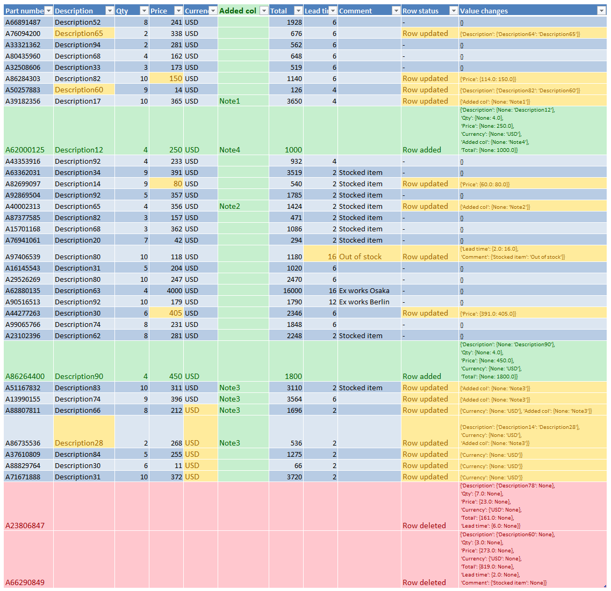

# similarpanda

A module to check for differences between pandas DataFrames and generate a report in Excel format.

This is helpful in a workplace setting where you might need to compare different versions of an Excel file.

## Features

- Compares two pandas DataFrames to detect changes.
- Generates an Excel report highlighting added, removed, and modified data.
- Supports key-based comparison or row-position matching.
- Uses built-in Excel styles to visually distinguish changes.
- Ignores formulas and formatting, focusing on cell values.

## Installation

```bash
pip install requirements.txt
```
If you are using a package manager such as [Poetry](https://python-poetry.org/docs/#installation), you can create an environment to maintain a separate virtual environment:
```bash
# If required, follow the guide to install Poetry. Then:
poetry install
```

## Usage

### Creating a SimilarPanda Object

```python
from similarpanda import SimilarPanda

sp = SimilarPanda(new=df_new, old=df_old, key_column='ID')
sp.output_excel('differences_report.xlsx')
```

### Inputs

- `new`: DataFrame (latest version)
- `old`: DataFrame (previous version)
- `key_column` (optional): A common column for row matching; otherwise, rows are matched by position.

### Returns

- A `SimilarPanda` object.
- Use `similarpanda.output_excel('filename.xlsx')` to generate an Excel report.

## Helper Jupyter Notebook

A Jupyter Notebook interface (`similarpanda_interface.ipynb`) is included, allowing users to:

- Load data from two Excel files.
- Load data from the clipboard.
- Generate a comparison report.

## Example Output




## License

This project is licensed under the MIT License.

